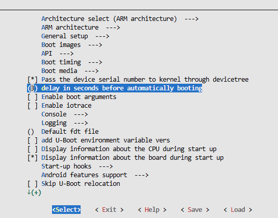

# Install driver and tool
1. Download and install ...

# Flashing eMMC
1. Set device to recovery mode

    ...
2. Flashing

    ...

# Download SDK
- Install dependencies:
    ```bash
    sudo apt update

    sudo apt-get install -y git ssh make gcc gcc-multilib g++-multilib module-assistant expect g++ gawk texinfo libssl-dev bison flex fakeroot cmake unzip gperf autoconf device-tree-compiler libncurses5-dev pkg-config bc python-is-python3 passwd openssl openssh-server openssh-client vim file cpio rsync
    ```

- Get SDK:
    ```bash
    git clone https://github.com/LuckfoxTECH/luckfox-pico.git
    ```
# Inspect config file (u-boot config focused)
- This file is a make script provided by the Luckfox team to simplify the build process. `../luckfox-pico/project/cfg/BoardConfig_IPC/BoardConfig-EMMC-Buildroot-RV1106_Luckfox_Pico_Ultra_W-IPC.mk`
    

- This line specifies the defconfig file being used: `luckfox_rv1106_uboot_custom_defconfig`, located in the `../luckfox-pico/sysdrv/source/uboot/u-boot/configs/` folder.
    ```bash
    export RK_UBOOT_DEFCONFIG=luckfox_rv1106_uboot_custom_defconfig
    ```

- This line defines additional fragment files. Their configurations are appended to the final configuration along with the defconfig file.
    ```bash
    export RK_UBOOT_DEFCONFIG_FRAGMENT="rk-emmc.config rv1106-luckfox-rgb-reset.config"
    ```

- These lines specify the target architecture and cross-compiler toolchain. The toolchain is located at `../luckfox-pico/tools/linux/toolchain/arm-rockchip830-linux-uclibcgnueabihf`
    ```bash
    # Target arch
    export RK_ARCH=arm

    # Target Toolchain Cross Compile
    export RK_TOOLCHAIN_CROSS=arm-rockchip830-linux-uclibcgnueabihf
    ```
2. Make our custom defconfig file.
    
    - At `../luckfox-pico/sysdrv/source/uboot/u-boot/` path, run commands
        ```bash
        make ARCH=arm luckfox_rv1106_uboot_defconfig                    (config file in /configs folder)
        make ARCH=arm menuconfig                                        (show config UI, remember to save before exit)
        make ARCH=arm savedefconfig                                     (generate defconfig file)
        mv defconfig configs/luckfox_rv1106_uboot_custom_defconfig      (move new created file back to /configs folder)
        ```

    - For example, we change boot delay parameter to 3 seconds at config UI
        <p>
        
        </p>

3. Build u-boot with new defconfig file
    
    - Edit `../luckfox-pico/project/cfg/BoardConfig_IPC/BoardConfig-EMMC-Buildroot-RV1106_Luckfox_Pico_Ultra_W-IPC.mk` file
        ```bash
        # Uboot defconfig
        # export RK_UBOOT_DEFCONFIG=luckfox_rv1106_uboot_defconfig
        export RK_UBOOT_DEFCONFIG=luckfox_rv1106_uboot_custom_defconfig
        ```
    - At `../luckfox-pico/` run
        ```bash
        ./build.sh clean uboot
        ./build.sh uboot
        ```

    - After build done, go to `..luckfox-pico/output/image/` and download 3 files `download.bin`, `idblock.img` and `uboot.img`. Copy `env.img` from vendor image files. Now put 4 files to seprated folder, from now on we will flash with files in this folder.
    
    - Using the flashing tool, write 4 files to eMMC. For this test, we will intentionally corrupt the kernel address by flashing U-Boot to the kernel partition. This prevents the kernel from loading and forces the system to stop at U-Boot. It only needs to be done once, since our focus is on U-Boot for now.

        <p>
        
        </p>

4. Check the UART console
        <p>
        
        </p>

    - You can see that U-Boot waits for 3 seconds before attempting to boot the kernel. Since the kernel cannot load, the boot process fails and control returns to the U-Boot console.

5. Toggle GPIO using u-boot console
    in u-boot console run
    ```bash
    gpio toggle 118
    ```
    This command will toggle onboard red LED (LED inside case, near USB port). Since this kind of hard to see, we run another command.
    ```bash
    gpio toggle 123
    ```
    This command will toggle LCD backlight.

    How to know the number of GPIO, number 118 and 123 coming from ? Inspsect the schematic file, we can see GPIO used to control backlight is GPIO3_D3_d. Now convert that GPIO number to the number that u-boot understand.
        <p>
        
        
        </p>
